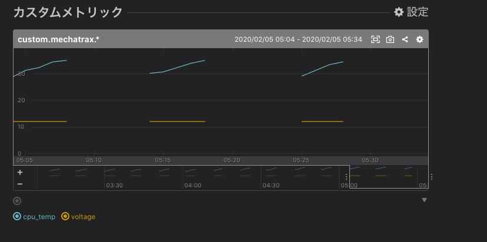
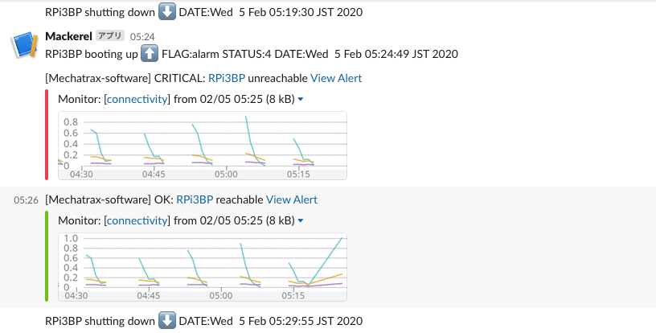

# sleepi2
[メカトラックス](https://mechatrax.com "メカトラックス") のラズベリーパイ向け周辺機器[slee-Pi2](https://mechatrax.com/products/slee-pi/ "slee-Pi2")を使用・評価するための環境を構築するansibleのplaybook です。

## 概略
このplaybookでは、slee-Pi2を接続したRaspberry piにslee-Pi2の動作ツールをインストールし、Mackerelを使ったデバイス・モニタリングを行うRaspberry piを構築します。

このplaybookは

- sleepi2: slee-Pi2を稼働するためのツール類をインストール
- mackerel: slee-Pi2が稼働するRaspberry piにMackerel agentをインストール
- startstop: Raspberry piのboot/shutdown時の処理を実現するsystemdのstartstop.serviceをインストールします

のロールから構成しています。

このplaybookをslee-Pi2を接続したRaspberry piに対して実行すると
Raspberry piをカスタムメトリックスを含めMackerelで管理・モニターできるようになり、Slackに起動・停止の通知ができるようになります。

予め以下のものが必要になります。

- MackerelのアカウントとAPIKEY https://mackerel.io/ja/api-docs/
- Slackのワークスペース・チャンネルとWEB_HOOK_URL https://slack.com/intl/ja-jp/help/articles/115005265063

## 条件
### ハード
- Raspberry pi 3 model B+
- slee-Pi2
### ソフトウェア
- Rasbian buster lite 2019-09-26
- ansible ver 2.7.7
- python version = 3.7.3

## ロール

### sleepi2

https://github.com/mechatrax/slee-pi2 に従ったセットアップを行います

### mackerel

https://mackerel.io mackerel-agentのmackerel-agent(v0.66.0) arm版をインストールします。
通常のシステム・メトリックスに加えて、CPU温度とslee-Pi2のVOLTAGE(電源電圧)を投稿します。
これらの投稿のため、agentインストール時にMackerelのapikeyが必要になり、inventoryに指定します。



### startstop

Mackerelでは各メトリックの監視に加え、ホスト(raspberry pi)の死活監視も可能です。しかし、その実装上の制限から、リアルタイムで検出することができません。

- https://mackerel.io/ja/docs/entry/faq/monitoring/how-work-connectivity-monitoring
- https://mackerel.io/ja/docs/entry/faq/monitoring/alert-interval

そのため、boot時、shutdown時にraspberry piからslackに直接投稿する仕組みを実装しました。systemdのstartstop.serviceとして実装しています。slackのWEb_HOOK_URLを叩くことで実装しており、BOOT時にはslee-Pi2の起動ステータスレジスタのフラグ・起動ステータスレジスタを表示します。
このため、slackのweb hook urlが必要になり、inventoryに指定します。

https://api.slack.com/messaging/webhooks

このweb hook urlは/opt/mechatrax/etc/WEBHOOKに記述されます。




また、slackへの通知は、/opt/mechatrax/bin/startstopにbashスクリプトで書かれていますので、メッセージの変更などは、playbookでインストール後に変更してください。

このstartstopスクリプトはslackへの投稿後、boot時は/opt/mechatrax/STARTUP.shをbashスクリプトとして実行します。起動直後に何か処理を行いたい場合、STARTUP.shに記述しておくことで、様々な機能を簡単に実行することができます。例えば同じディレクトリにあるstart_shutdonw_in_5min_then_power_on_in_10minをSTARTUP.shにリネイムしておくと、次の再起動後、そのraspberry piは"起動-5分-停止-5分-再起動"を繰り返すようになります。

同様に、同じディレクトリにあるstart_online_on_bussiness_timeをSTARTUP.shにリネイムしておくと、次の再起動後、「9:00に再起動をslee-Pi2に予約してshutdownするコマンド」を17:00に発火するatコマンドを実行します。これによりビジネス・タイム(am9:00-PM5:00)のみ稼働するRaspberry piになります。
同様な処理は、STARTUP.shとSHUTDOWN.shを組み合わせても可能です。状況に応じて実装してください。


同様にshutdown時には/opt/mechatrax/SHUTDOWN.shをbashスクリプトとして実行します。

いずれも、必要に応じて、スクリプトを作成して配置してください。デフォルトではいずれも何もしないスクリプトになっています。

また、systemdはstartstopスクリプトを経由してSTARTUP.sh/SHUTDOWN.shを起動しますので、いずれもsystemdの制限を守るようにしてください。例えば、タイムアウト制限などを回避するには、start_shutdonw_in_5min_then_power_on_in_10minにあるようにバックグラウンドで動作させる、もしくはstart_online_on_bussiness_timeにあるようにJOBスケジュールをatコマンドで登録するなどスクリプト自体は直ちに終わるようにします。

## インベントリ

インベントリに必要な編集を行ってください。テンプレートとしてhosts.tmplを用意しています。


```
[raspi]
192.168.3.17 hostname=RPi3BP # raspberry piのIPアドレスを指定します。hostnameの指定があれば、そのhostnameにします

[raspi:vars]
ansible_ssh_user=pi # 認証情報を指定します
ansible_ssh_pass=raspberry # 認証情報を指定します
apikeys=xxxxxxxxxxxxxxxxxxxxxxxxxxxxxxxxxxxxxxxxxxxx  # MackerelのAPIKEYを指定
web_hook_url=https://hooks.slack.com/services/xxxxxxxxx/xxxxxxxxx/xxxxxxxxxxxxxxxxxxxxxxxx # slackのweb hook urlを指定
```

## Quick Start
インベントリを編集後、playbookを実行してください。

```
ansible-play -i hosts sleepi2.yml
```

[](https://asciinema.org/a/UlZA0hYBKC9oKay9yzSfxY2ok)

# TODO
##   wifi/4Gカスタムメトリックス
##   Raspberry pi 4 model B
